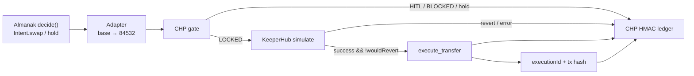

# Almanak KeeperGate

**Almanak × KeeperHub via Cubiczan CHP gate** — Almanak strategies emit DeFi intents; a fail-closed CHP policy gate decides; KeeperHub is the only path that may move value onchain.

Package: `almanak-keeperhub-chp` · MIT · Cubiczan / Shyam Desigan (`sam@cubiczan.com`)

---

## Hackathon

**[KeeperHub – The Agent Economy Hackathon](https://dorahacks.io/hackathon/agent-economy)** (DoraHacks)

**Main track: Best Integration into a Live Project**

Live project from the brief: **[Almanak](https://almanak.co)** (DeFi strategy / agent platform). Cubiczan CHP is the governance glue, not the live-project claim.

| Role | What it is |
| --- | --- |
| **Almanak** | Live strategy runtime. `IntentStrategy.decide()` → `Intent.swap` / `Intent.hold`. [SDK](https://github.com/almanak-co/sdk) · [docs](https://sdk.docs.almanak.co/) |
| **Cubiczan CHP** | Fail-closed policy gate + HMAC audit ledger (this repo; same state names as [agent-governance](https://github.com/icohangar-ops/agent-governance), original simplified code) |
| **KeeperHub** | Deterministic execution. Simulate, then `execute_transfer` only if CHP is `LOCKED`. [MCP](https://app.keeperhub.com/mcp) · [MCP docs](https://docs.keeperhub.com/ai-tools/mcp-server) · [Direct Execution API](https://docs.keeperhub.com/api/direct-execution) |

---

## Problem

Almanak agents are allowed to be probabilistic. Swaps, rebalances, and treasury clips are *intents* — “buy the dip if ETH is cheap.” Onchain value transfer is not probabilistic. A compiled intent that skips policy, dry-run, or audit is a capital bug.

Something must sit between `decide()` and the chain: **caps, allowlists, human-in-the-loop, simulate-then-execute, and a ledger you can show a judge.**

---

## Solution

```
Almanak decide()
    → CHP  EXPLORING → PROVISIONAL → LOCKED | HITL_REQUIRED | BLOCKED
    → KeeperHub simulate (simulate: true)
    → execute_transfer  only if LOCKED and wouldRevert=false
    → dual audit: CHP HMAC ledger + KeeperHub executionId / tx hash (live only)
```

| Step | What happens |
| --- | --- |
| 1. Almanak intent | `TreasuryDipBuy.decide(market)` returns `Intent.swap(USDC→ETH, $25, chain="base", protocol="uniswap_v3")` or `Intent.hold` |
| 2. Compile | Adapter remaps Almanak `base` → Base Sepolia `84532` and builds a KeeperHub transfer plan |
| 3. CHP gate | Policy YAML: max notional, daily cap, venue/chain allowlist, min confidence. Missing fields **BLOCK** (fail-closed) |
| 4. Simulate | `POST /api/execute/transfer` with boolean `"simulate": true`. Continue only if `success` and `wouldRevert: false` |
| 5. Execute | Same body, no `simulate`, plus `Idempotency-Key`. **Never** called unless state is `LOCKED` |
| 6. Audit | CHP HMAC chain (`seq`, `prevHash`, `hmac`) + KeeperHub `executionId`. Live path may also store a real `transactionHash`. **MOCK never invents a hash.** |

`HITL_REQUIRED` and `BLOCKED` stop before KeeperHub write. `Intent.hold` never becomes a capital move.

---

## Live project: Almanak

Almanak is the named live project in the KeeperHub Agent Economy brief. Production strategies implement `decide(market: MarketSnapshot) -> Intent | None` ([getting started](https://sdk.docs.almanak.co/getting-started.html), [Intent.swap](https://sdk.docs.almanak.co/api/intents.html)).

This repo does **not** vendor the Python SDK. It reimplements the public vocabulary so judges can run offline:

- `IntentStrategy.decide()`
- `Intent.swap({ fromToken, toToken, amountUsd, chain, protocol, maxSlippage })`
- `Intent.hold(reason)`
- serialize/deserialize with Almanak field names (`intent_type`, `from_token`, `amount_usd`, `chain`, `protocol`)

**Fidelity choices**

- Sample strategy is the SDK dip-buy shape: ETH &lt; $2,000 and idle USDC &gt; $500 → swap $25 USDC→ETH on `uniswap_v3`.
- Almanak chain name `"base"` remaps to **Base Sepolia (`84532`)** when `KEEPERHUB_CHAIN_ID` is a testnet, so a faithful `decide()` can settle without a mainnet wallet.
- A live Almanak worker plugs in by POSTing `Intent.serialize(intent)` into `Intent.deserialize` (see `examples/almanak_hook.py`). Secrets stay in Almanak’s gateway sidecar.

CHP evaluates the **Almanak USD notional** ($25). The onchain amount defaults to `KEEPERHUB_TRANSFER_AMOUNT=0.001` so a DoraHacks proof stays cheap.

---

## KeeperHub surfaces used

Code talks **REST Direct Execution** (same tools the MCP server exposes). We do **not** speak MCP JSON-RPC in-process.

| Surface | Used? | Where |
| --- | --- | --- |
| HTTP MCP `https://app.keeperhub.com/mcp` (`Bearer kh_...`) | Documented / same auth | Judges can attach this MCP to an agent with the same key |
| `POST /api/execute/transfer` + `"simulate": true` | **Yes** | `src/keeperhub/live.ts` `simulateTransfer` |
| `POST /api/execute/transfer` + `Idempotency-Key` | **Yes**, LOCKED only | `executeTransfer` |
| `GET /api/execute/{executionId}/status` | **Yes** | Poll until `completed` / `failed`; 409 replay uses `originalExecutionId` |
| MCP tools `execute_transfer`, `get_direct_execution_status` | Equivalent REST | Documented first-write sequence |
| `execute_protocol_action` (`uniswap_v3/swap`) | **Noted, not called** | Adapter comment only; demo settlement is `execute_transfer` |
| MOCK adapter | **Yes** when `KEEPERHUB_API_KEY` unset | Labeled `MOCK`. No fabricated `transactionHash` |

Live sequence matches KeeperHub docs: boolean `simulate` (not the string `"true"`), then the same body with a SHA-256 key of `taskId|chainId|recipientAddress|amount|tokenAddress`.

---

## Architecture



```
src/almanak/     Intent factory, MarketSnapshot, IntentStrategy, TreasuryDipBuy, compiler
src/chp/         Policy YAML, EXPLORING→… state machine, HMAC ledger
src/keeperhub/   Mock + live REST adapters
src/cli/demo.ts  Judge walkthrough
policy.example.yaml
```

| Policy field | Demo | Fail-closed effect |
| --- | --- | --- |
| `max_notional_usd` | 100 | Above → `BLOCKED` |
| `hitl_notional_usd` | 50 | At/above and ≤ max → `HITL_REQUIRED` |
| `daily_cap_usd` | 250 | Projected spend above → `BLOCKED` |
| `min_confidence` | 0.70 | Below → `BLOCKED` (or HITL if flagged) |
| `allowed_chains` | `84532`, `11155111` | Else `BLOCKED` |
| `allowed_venues` | `uniswap_v3`, `aerodrome`, `enso`, `keeperhub_transfer` | Else `BLOCKED` |

---

## Quickstart

```bash
npm install
npm test              # 23 tests — gate, ledger, adapter, pipeline
npm run demo          # $25 swap → LOCKED → MOCK simulate/execute
npm run demo:blocked  # $5,000 clip → BLOCKED (no KeeperHub write)
```

No secrets required. Unset `KEEPERHUB_API_KEY` → full CHP flow + **MOCK** receipt. MOCK never invents a tx hash.

**Live (optional, for a real DoraHacks tx)**

```bash
cp .env.example .env
# KEEPERHUB_API_KEY=kh_...          # app.keeperhub.com → Settings → Developer → org keys
# KEEPERHUB_CHAIN_ID=84532          # Base Sepolia (11155111 also allowed)
# KEEPERHUB_RECIPIENT_ADDRESS=0x…   # all-lowercase or valid EIP-55
# KEEPERHUB_TRANSFER_AMOUNT=0.001
npm run demo
```

Fund the KeeperHub wallet integration on Base Sepolia first. Keep the printed `transactionHash` / `transactionLink` — that is the submission proof.

---

## Demo video & submission checklist

Film script: [DEMO.md](./DEMO.md) (≤3 min). `npm run demo` then `npm run demo:blocked`.

| Item | Status |
| --- | --- |
| Public MIT repo (`almanak-keeperhub-chp`) | Publish to `github.com/Cubiczan` (mirror `icohangar-ops` if the org token is available) |
| Demo video | Record from DEMO.md; MOCK is acceptable if labeled; attach a live tx if you have a key |
| KeeperHub tx link | Only after a LIVE run. Do not paste a made-up hash |
| `npm test` / `npm run demo` green offline | Yes |

**What still breaks / is out of scope**

- Not a hosted Almanak cloud deployment — the adapter is the public `decide()` / `Intent.swap` contract, not `pipx install almanak` inside this repo.
- `execute_protocol_action` (DEX swap) is not implemented; the onchain slice is `execute_transfer` so a fresh org wallet can land a verifiable testnet tx.
- `HITL_REQUIRED` is recorded and stops execution; there is no approval UI to promote it to `LOCKED`.
- Re-running the happy-path demo many times can trip `daily_cap_usd` via `.chp/*.jsonl`.
- Live path needs a funded KeeperHub wallet + valid recipient checksum. Simulation errors are fail-closed (no broadcast).

---

## Judging rubric

| Criterion | How this repo answers it |
| --- | --- |
| **Integration depth** | Almanak is the live project: same `IntentStrategy.decide` / `Intent.swap` shapes, serialize field names, and a documented gateway hook. CHP is glue, not the integration claim. |
| **Execution through KeeperHub** | LOCKED cycles call the documented simulate → `execute_transfer` → status poll path (REST equivalents of the MCP tools). Writes are skipped on HITL/BLOCKED/hold. |
| **Reliability / observability** | Fail-closed policy; boolean simulate; stable Idempotency-Key; HMAC-chained ledger with tamper check; MOCK vs LIVE labeled; no synthetic tx hashes. |
| **Usefulness** | A capital-moving Almanak agent can be allowed to *decide* without being allowed to *broadcast*. Caps, allowlists, and HITL are the missing production control. |
| **DX** | `npm install && npm test && npm run demo` with no keys. Policy is YAML. `.env.example` is the live checklist. DEMO.md is a 3-minute film script. |

---

## License

MIT © Cubiczan / Shyam Desigan · `sam@cubiczan.com`

## Propagation notes (wave B)

- **Row 6 (dual-authority governor) — reversed.** The row's portability
  warning fires: enforcement happens inside the KeeperHub execution service
  (`src/keeperhub/live.ts` posts `/api/execute/transfer`), not at any surface
  this repository controls. There is no on-chain policy hook or
  account-abstraction wallet here to install a second authority into — the
  CHP gate (`src/chp/gate.ts`) already deny-gates every execution request
  before KeeperHub sees it, which is the strongest boundary the repo owns.
  Reopens if KeeperHub exposes a per-transfer policy hook or the desk moves
  to self-custodied execution.
- **Row 10 (sealed evidence envelopes) — reversed.** The evidence chain is
  already integrity-protected locally — `src/chp/ledger.ts` HMAC-SHA256-chains
  canonical payload digests with verify-on-read — but the permanent-sealing
  half of the row (batching ledger roots into on-chain or blob storage) has no
  surface to adopt: all chain interaction is delegated to the KeeperHub HTTP
  API (simulate/execute transfer only), so anchoring would require a new
  external contract deployment, not an adoption of the pattern. Reopens when
  the desk gains a chain surface of its own (self-custodied executor or a
  KeeperHub attestation endpoint).

[Hackathon page](https://dorahacks.io/hackathon/agent-economy) · [Almanak SDK](https://github.com/almanak-co/sdk) · [KeeperHub MCP](https://docs.keeperhub.com/ai-tools/mcp-server)
